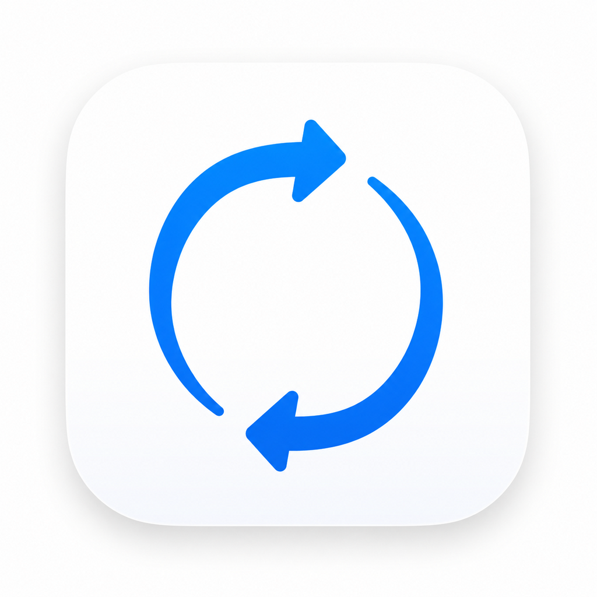

<p align="center">
  
</p>

# Drag

[](https://github.com/ryandam9/Drag/actions/workflows/ci.yml)

A cross-platform **file transfer client** built with Flutter for macOS, Linux
& Windows desktop — a dark, dense, developer-focused UI with drag-and-drop
transfers between **local disk, Amazon S3, and SFTP** endpoints.

## Endpoints

Either browser pane can point at any endpoint, so you can move files between
any combination:

- **Local ⇄ S3** — upload/download between your machine and an S3 bucket.
- **S3 ⇄ S3 (cross-account)** — copy between two buckets in *different* AWS
  accounts/regions. Copies are **streamed** through the client
  (`source.openRead → dest.write`), so each side can use its own credentials —
  no server-side copy and no shared-account requirement.
- **SFTP ⇄ Local / S3** — real SFTP via `dartssh2` (password or private-key
  auth); browse, upload and download against any SSH server, and stream
  to/from S3 or local with no temp files.

**S3 is real**, and talks to S3 through a **hand-written client** — there is no
official AWS SDK for Dart, so Drag ships its own AWS **Signature V4** signer
(`lib/fs/aws/sigv4.dart`) and a minimal S3 REST client (`lib/fs/aws/s3_client.dart`)
built on `dart:io` `HttpClient` (streamed `ListObjectsV2` / `GetObject` /
`PutObject`). No third-party S3 SDK is used. Configure an S3 connection in the
**Connection Manager** (Access Key, Secret, optional Session Token, Region,
Bucket, optional custom endpoint for S3-compatible services), hit **Connect**,
then pick it in a pane. The **Local** endpoint browses your real filesystem.

> The SigV4 implementation is verified against AWS's published signing-key test
> vector, and the full client is exercised end-to-end (upload/list/download +
> cross-bucket copy) in `test/s3_integration_test.dart`.

> Credentials are held in memory for the session and are not persisted to disk.

## Screens

| Screen | Description |
| --- | --- |
| **Browser** | Dual-pane file browser with **multiple session tabs** — connect to several servers at once and switch between them; each tab keeps its own Local ⇄ remote panes, paths and listings. **Each pane has an endpoint picker** (Local / any saved S3 or SFTP connection). Drag a file from either pane onto the other to start a transfer. **Multi-select** (Ctrl/Cmd-click to toggle, Shift-click for a range) drives multi-file drag and delete. **File operations** — new folder, rename, delete (with confirmation) on Local / S3 / SFTP, via toolbar, right-click context menu, or keyboard (F2 rename, Del delete, Backspace up); Back / Forward / Up navigation history per pane. Async listing with loading/error/not-connected states, breadcrumbs, live progress strip and a log console. |
| **Connection Manager** | Saved/recent sessions sidebar with online indicators. Form adapts to the protocol: SSH fields for SFTP, or **S3 credentials** (access key, secret, session token, region, bucket, endpoint, SSL) for S3. New / Save / Duplicate / Delete **persist to SQLite** (secrets excluded — see #16). |
| **Transfer Queue** | Active / queued / paused / done / error transfers with per-file progress, speed, ETA, a status filter, an aggregate stats bar and an adjustable parallel-thread count. |
| **History Dashboard** | Persistent transfer history backed by **SQLite** — stat cards (total / succeeded / failed / data transferred / avg speed) and a table of past transfers (file, route, size, time taken, speed, when, status). Refresh / clear. |
| **Preferences** | Categorised settings with theme, accent-color swatches, fonts and toggles. |

While a transfer runs, a floating **progress card** (animated ring + bar, live
speed/ETA, "big file" badge) appears. On completion an in-app **notification**
reports the destination path, size and time taken. Every finished transfer is
written to the SQLite history database.

## Highlights

- **Drag & drop** local files onto the remote pane to start a transfer.
- **Live transfer engine** (`AppState`) advances active transfers, promotes
  queued ones up to the thread budget, and fires completion toasts.
- Pixel-faithful dark theme ported from the mockup's CSS variables
  (`lib/theme.dart`), with Inter + JetBrains Mono via `google_fonts`.
- Resizable split between the two file panes.
- Pause / resume / clear-done queue controls and per-row pause/retry.

## Project layout

```
lib/
  main.dart                    App entry + AppScope wiring
  app_shell.dart               Title bar + nav rail + screen switcher + toasts
  theme.dart                   Colors, text styles, ThemeData
  state/
    app_state.dart             ChangeNotifier: navigation, panes, queue, toasts
    pane_controller.dart       Per-pane endpoint/path/listing/selection state
  fs/
    storage_backend.dart       StorageBackend interface + LocalBackend + S3Backend
    sftp_backend.dart          Real SFTP backend (dartssh2)
    simulated_backend.dart     Offline SFTP demo backend (tests/fallback)
    transfer_service.dart      Streams source → dest with live progress (S3/local)
    aws/
      sigv4.dart               Hand-written AWS Signature V4 signer
      s3_client.dart           Minimal S3 REST client (List/Get/Put) on HttpClient
  models/                      FileItem, Connection (incl. S3 fields), Transfer (timing)
  data/
    mock_data.dart             Seed connections (incl. two S3 accounts)
    history_db.dart            SQLite history repository (sqflite_common_ffi)
    connection_store.dart      SQLite store for saved connections (no secrets)
  widgets/                     Title bar, buttons, badges, nav, toasts,
                               transfer_progress (active-transfer card)
  screens/                     browser / connection_manager / transfer_queue /
                               dashboard / settings
```

## Running

```bash
flutter pub get

# Pick your desktop platform:
flutter run -d linux
flutter run -d macos
flutter run -d windows
```

## Building a release bundle

```bash
flutter build linux --release     # build/linux/x64/release/bundle/
flutter build macos --release
flutter build windows --release
```

## Tests & analysis

```bash
flutter analyze
flutter test                 # 72 hermetic tests
```

Coverage spans the whole stack:

| File | What it covers |
| --- | --- |
| `models_test.dart` | byte/date formatting, `FileItem`, `Connection` (S3 readiness), `Transfer` |
| `backends_test.dart` | `LocalBackend` (real temp-dir listing + byte round-trip), `S3Backend` path math, `SimulatedBackend` |
| `pane_controller_test.dart` | listing, navigation (enter dir / `..` / up), selection, breadcrumb, not-ready short-circuit |
| `app_state_test.dart` | navigation, queue counts & controls, toasts, simulated ticker, endpoint switching, `connect`, and all `dropTransfer` decisions (incl. a real Local→Local transfer) |
| `sigv4_test.dart` | AWS SigV4 — signing key vs **AWS's published test vector**, header/encoding |
| `transfer_test.dart` | `TransferService` streaming with progress |
| `screens_widget_test.dart` | Connection Manager (S3 vs SSH form + editing), Transfer Queue, Settings toggles, toasts |
| `widget_test.dart` | app boot + nav rail |

Real end-to-end S3 tests live in `s3_integration_test.dart` and **auto-skip**
unless an S3 server is supplied:

```bash
flutter test test/s3_integration_test.dart \
  --dart-define=S3_ENDPOINT=127.0.0.1:9000 \
  --dart-define=S3_BUCKET=bucket-a --dart-define=S3_BUCKET2=bucket-b \
  --dart-define=S3_KEY=... --dart-define=S3_SECRET=...
```
